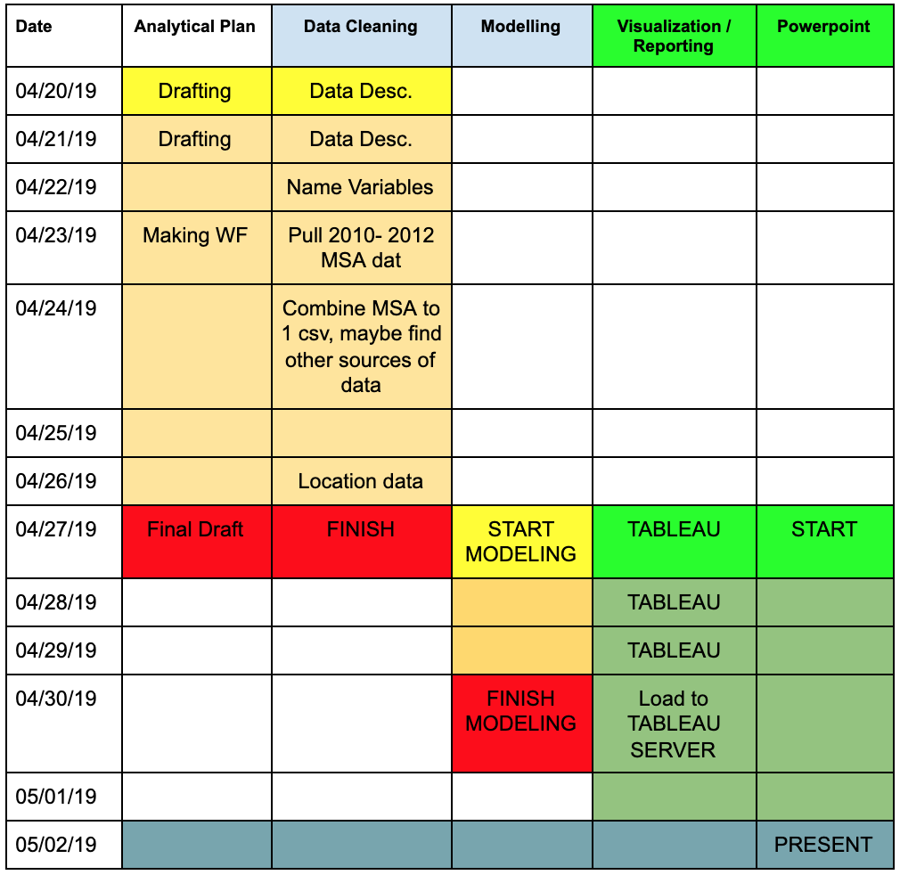

## Welcome to Keita & Nick's Applied Analytics Project   

Hi Duncan, this is our [workflow for our project](https://drive.google.com/file/d/1WSKUeWjirDklZm_4Md1jvWOxYGtyvEtC/view?usp=sharing).

## Section 1: Goal of the Analytical Plan  
(text)
- mention the SMART (specific, measurable, appropriate, realistic, timely) ??

## Section 2: Main objective / Problem  
Our main objective is to design and communicate an analytical plan for determining the best 10 markets (DMA) to compete effectively against an established competitor such as Walmart. The main results should be in the form of an analytical plan of our workflow / findings / etc, a presentation, and a github page with all of our datasets and codings.  

## Section 3: Result _(What is our end goal)_  
The main result or output of the project is to have a written analytical plan in the form of a document, powerpoint presentation with all of our findings, a github repository of all the resources, and an x-factor (which may be in a form of a website, dashboard, dynamic html/markdown).  

## Section 4: Resources and Technology  
(text)

## Section 5: Data Concerns  
(text)

## Section 6: Structure and Team  
For structuring the project, we have split the workload into two main part: Visualization and Modelling. Visualization incorporates using sales-aid technology tools to create a dashboard and insights will be derived from the findings solely from the dashboard. Modelling will use programming languages such as R and Python to find top 10 DMA location using predictive modeling and unstructured data analysis.

## Section 7: Reporting and Visualization  
**Visualization:**  
Using Tableau as the main Business Intelligence tool, we were able to come up with 10 initial DMA locations. San Diego, Salt Lake City, Houston, Tampa, Los Angeles, Cleveland, Philadelphia, and Austin were the location that seemed to be most appropriate for the retail launch locations. The insights were derived from 4 main charts: geographical chart that displays the percentage change of population for each States, a heat map that indicates each DMA’s median household income, bar chart that displays the optimized sales information by overlaying average weekly sales per store size against average weekly sales, and weekly sales shown as a line graph over 4 quarters. Our decisions of the top 10 locations were decided based on 4 key metrics: (1) location should be in an area with a growing population, (2) median household income of around $60,000 to $75,000, (3) the location should also be in above the 50th percentile for average weekly sales per store size, and (4) preferably a location with unemployment rate of less than 7.5%.

Result: [Dashboard made from Tableau](https://public.tableau.com/shared/JHNYQR36C?:display_count=yes).

**Modelling/Reporting:**  
TODO (Nick)

## Section 8: Timeline


Syntax highlighted code block
```
# Header 1
## Header 2
### Header 3

- Bulleted
- List

1. Numbered
2. List

**Bold** and _Italic_ and `Code` text

[Link](url) and 
```
